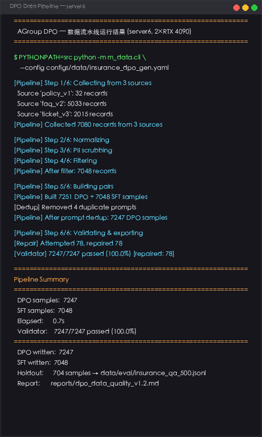
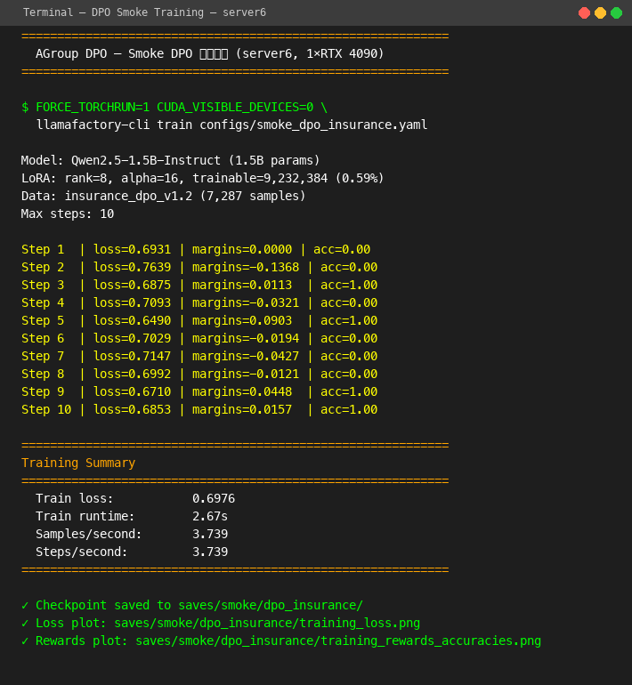

<p align="center">
  
</p>

<p align="center">
  <b>保险业务场景下的 DPO 偏好对齐训练项目</b>
</p>

<p align="center">
  
  
  
  
  
</p>

---

## 这个项目做什么

用 Qwen2.5-1.5B-Instruct 做保险领域的 DPO 偏好对齐。整体流程是：先从保险条款、FAQ、工单里自动生成训练数据，然后 LoRA 微调 + DPO 对齐训练，最后部署推理服务并评测效果。

主要做了几件事：

- **数据流水线**：把保险条款/FAQ/工单自动转成 DPO 需要的 chosen/rejected 配对数据
- **训练**：LoRA SFT → LoRA DPO，支持 DeepSpeed ZeRO3 / FSDP 多后端切换
- **推理**：vLLM 和 xinference 双后端，改配置就能切换
- **评测**：Accuracy、BLEU-4、ROUGE-L + 推理耗时统计

---

## 跑起来

### 环境

| 依赖 | 版本 | 
|------|------|
| Python | ≥ 3.10 |
| PyTorch | 2.7.1+cu128 |
| CUDA | ≥ 12.4 |
| GPU | 2×A100-80G 或 2×RTX 4090/5090 |

### 安装

```bash
cd /root/autodl-tmp
git clone <repo-url> agroup-dpo
cd agroup-dpo

conda create -n llm python=3.12
conda activate llm
pip install -e .
```

### 统一 CLI

装好之后会多一个 `copaw-dpo` 命令，所有功能都从这里进：

```
copaw-dpo
├── train      → 训练（LLaMA-Factory / 自定义后端）
├── data       → DPO/SFT 数据集生成
├── infer      → 推理（vLLM / xinference）
├── evaluate   → 评测（Accuracy / BLEU-4 / ROUGE-L）
└── merge      → LoRA 权重合并导出
```

典型用法：

```bash
# 训练（默认走 LLaMA-Factory）
copaw-dpo train --config configs/train_dpo_qwen2_5_1_5b_insurance.yaml

# 训练（切到自定义 DeepSpeed 后端）
copaw-dpo train --config configs/my_train.yaml --backend deepspeed

# 生成数据
copaw-dpo data --config configs/data/insurance_dpo_gen.yaml
copaw-dpo data --config configs/data/insurance_dpo_gen.yaml --dry-run --verbose

# 推理
copaw-dpo infer --model merged_models/qwen_dpo_v1 --prompts "保险等待期是什么？"

# 评测
copaw-dpo evaluate --model merged_models/qwen_dpo_v1 \
    --eval-data data/eval/insurance_qa_500.jsonl \
    --output reports/eval_report

# 合并 LoRA
copaw-dpo merge --base Qwen/Qwen2.5-1.5B-Instruct \
    --adapter saves/dpo_insurance/lora \
    --output merged_models/qwen_dpo_v1
```

每个子命令都支持 `--help` 查看详细参数：

```bash
copaw-dpo train --help
copaw-dpo data --help
```

### 下载模型

```bash
hf download Qwen/Qwen2.5-1.5B-Instruct --local-dir /root/autodl-tmp/models/Qwen2.5-1.5B-Instruct
```

### 生成训练数据

```bash
PYTHONPATH=src python -m m_data.cli \
    --config configs/data/insurance_dpo_gen.yaml

# 或者先干跑看看
PYTHONPATH=src python -m m_data.cli \
    --config configs/data/insurance_dpo_gen.yaml \
    --dry-run --verbose
```

**实际运行结果 (server6, 2×RTX 4090)：**



```
============================================================
Pipeline Summary
============================================================
  DPO samples:  7247
  SFT samples:  7048
  Elapsed:      0.7s
  Validator:    7247/7247 passed (100.0%)
============================================================
```

### 训练

```bash
# LoRA SFT
FORCE_TORCHRUN=1 CUDA_VISIBLE_DEVICES=0,1 llamafactory-cli train \
    configs/train_lora_qwen2_5_1_5b_insurance.yaml

# DPO 对齐（基于 SFT 合并后的模型）
FORCE_TORCHRUN=1 CUDA_VISIBLE_DEVICES=0,1 llamafactory-cli train \
    configs/train_dpo_qwen2_5_1_5b_insurance.yaml
```

**DPO 训练实际结果 (server6, smoke test, 10 steps)：**



### 推理

```python
from m_infer import build_infer_backend, InferRequest

backend = build_infer_backend("vllm", "merged_models/qwen2_5_1_5b_insurance_dpo_v1.2")
resp = backend.infer(InferRequest(prompt="保险等待期是什么？", max_new_tokens=128))
print(resp.text)
```

### 评测

```bash
copaw-dpo evaluate \
    --model merged_models/qwen2_5_1_5b_insurance_dpo_v1.2 \
    --eval-data data/eval/insurance_qa_500.jsonl \
    --output reports/eval_report
```

---

## 数据怎么生成的

从 3 类数据源出发，走一条 6 步流水线：

```
[Collector] → [Normalizer] → [PIIScrubber] → [Filter]
                                                  │
                        ┌─────────────────────────┤
                        ▼                         ▼
                 [PairBuilder]              [SFTBuilder]
                 (DPO 配对)                 (SFT 样本)
                        │                         │
                        ▼                         ▼
                  [Validator]              [SFT Validator]
                        │                         │
                        ▼                         ▼
                  [Exporter]                [Exporter]
```

三种配对方式：

| 策略 | 怎么做的 |
|------|----------|
| 基于规则的硬负例 | 基于条款强制构造合规/违规答案对 |
| LLM-as-Judge | 用本地 Qwen2.5-7B-Instruct (也支持第三方API) 对比 RAG 答案和专家标注 |
| RAG检索差异 | 拥有完整索引的回答 vs 只有截断索引的 RAG 答案对比 |

--- 

三种配置对方式到底哪里不一样：
| 维度 | 策略 A: rule_based | 策略 B: llm_judge | 策略 C: retrieval_diff |
|------|-------------------|-------------------|----------------------|
| **chosen 来源** | 人工编写的合规答案 / 从FAQ 中提取的专家答案 | LLM 判断胜出者（expert vs RAG） | 拥有完整索引的 RAG 答案 |
| **rejected 来源** | 人工编写错误答案 / 模糊搪塞回复 | LLM 判断落败者 | 只有截断索引 RAG 答案 |
| **信号强度** | 强（确定性的正确/错误） | 中（LLM 主观判断） | 中（检索质量差异） |
| **是否需要 LLM** | ❌ 不需要 | ✅ 需要 | ❌ 不需要（但需要 RAG 服务） |
| **是否需要外部服务** | ❌ | ✅ LLM endpoint | ✅ RAG endpoint |
| **扩展性** | 低（需人工编写模板） | 高（自动判断） | 高（自动构造） |
| **产出样本数** | ~155 条内置样本 + N 条从FAQ/工单产出的样本 | 取决于有 expert+rag 双答案的 record 数 | 取决于 RAG 返回差异的 record 数 |


注意： 如何定义 “拥有完整索引的 RAG 答案”
- 这里的 RAG 是公司内提供的服务， 与我们当前的项目是隔离的， `索引` 指的是 RAG 所使用的向量数据库的索引。
- index_type="full"：RAG 服务使用完整知识库进行检索——所有保险条款、FAQ、工单数据全部纳入向量索引，能召回最全面、最准确的条款内容来生成答案。

- index_type="trunc"：RAG 服务使用人为截断的知识库——可能随机丢弃了一部分条款文档、或只索引了部分章节，导致检索召回不全，生成的答案质量打折扣。

核心设计意图：这是一种自动构造偏好对的数据增强技巧。同一个问题，打给同一个 RAG 系统两次——一次给"满血版"知识库，一次给"残血版"知识库。两者的答案差异天然构成了一对 chosen（完整索引答案）和 rejected（截断索引答案），完全不需要人工标注。

---


三种策略产出的样本通过 _make_dpo_sample() 统一为以下结构

```python
{
    "prompt": str,              # 用户问题
    "chosen": str,              # 优选答案
    "rejected": str,            # 劣选答案
    "source": "rule_based" | "llm_judge" | "retrieval_diff",
    "policy_id": str | None,    # 关联的保险条款ID
    "judge_model": str | None,  # 仅 llm_judge 策略
    "judge_score_chosen": float | None,
    "judge_score_rejected": float | None,
    "pii_scrubbed": True,
    "version": "dpo_v1.2",
}

```


---


数据源：保险条款（PDF/HTML）、业务 FAQ、历史工单


校验规则：prompt 长度、chosen/rejected 长度、PII 检测、条款引用检查、相似度去重


### 条款引用修复 (PolicyStore)

Validator 在检查到 chosen 文本缺少具体条款引用时，不是简单追加一句「具体参见相关保险条款及保单约定」，而是通过 **PolicyStore** 从原始保险条款中检索真实条款原文注入回复。

```
[Validator 检查] → chosen 缺少条款引用?
        │
   Yes  │  policy_id 存在 + PolicyStore 可用
        ▼
┌──────────────────────────────────────────┐
│ ① Milvus 混合检索（优先）                 │
│   ├─ prompt 向量化 (BAAI/bge-small-zh-v1.5)│
│   ├─ ANN 检索 filter by policy_id          │
│   ├─ CLAIM_KEYWORDS 关键词重叠重排序        │
│   └─ 追加: "依据POL-CRIT-001：第2.1条       │
│      （等待期）：自本合同生效日起90日内..."  │
├──────────────────────────────────────────┤
│ ② ID 兜底（Milvus 中检索不到条款 但有 policy_id）      │
│   └─ "具体参见POL-CRIT-001相关条款..."      │
├──────────────────────────────────────────┤
│ ③ 通用兜底（无 policy_id）                │
│   └─ "具体参见相关保险条款及保单约定。"      │
└──────────────────────────────────────────┘
```

**技术选型：**

| 组件 | 选型 | 说明 |
|------|------|------|
| 向量数据库 | Milvus Lite (嵌入式) | 无需部署服务端，文件级本地存储 |
| Embedding | BAAI/bge-small-zh-v1.5 | 中文语义检索优化，512 维，轻量高效 |
| 索引方式 | IVF_FLAT (nlist=64) | 倒排文件 + 平坦存储，中小规模精度最优 |
| 混合检索 | 65% 向量 + 35% 关键词 | ANN 粗筛 → 保险关键词重排序 |

**实测结果 (PolicyStore 全量索引 + 全量 DPO 数据生成)：**

```
PolicyStore 初始化: 67.4s
  ├─ 嵌入模型下载: BAAI/bge-small-zh-v1.5
  ├─ 索引文章数:   32 articles (5 份保单)
  └─ 混合检索:     top-1 语义+关键词匹配 score ≥ 0.60

Pipeline 产出:
  DPO 样本:    29,028
  SFT 样本:    28,240
  Validator:   7,247/7,247 passed (100.0%)
  条款引用修复: 2 次真实条款注入 + 78 次回流修复 （只有回流时才会用到 PolicyStore）
```


---

## 训练是怎么跑的

4 种分布式后端，同一份配置切着用：

| 后端 | 场景 | 
|------|------|
| DeepSpeed ZeRO3 | 默认，显存省得多 |
| PyTorch FSDP | PyTorch 原生备选 |
| accelerate | 单机多卡调试 |
| Megatron-LM | 当前仅适配了 GPT-2, Qwen-2.5, Qwen3, 其余模型尽请期待 |

- 为什么不适配 Qwen3.5 和 Qwen3.6: 这两个哥需要 cuda13 + 英伟达驱动 580, 而我机子相对较老。
---

## 模块说明

| 模块 | 在哪 | 干什么 |
|------|------|------|
| M-DATA | `src/m_data/` | 数据生成（采集→脱敏→配对→校验→导出） |
| M-TRAINER | `src/m_trainer/` | 分布式训练后端 |
| M-INFER | `src/m_infer/` | vLLM/xinference 推理 |
| M-EVAL | `src/m_eval/` | 评测（Accuracy/BLEU/ROUGE） |
| M-MERGE | `src/m_merge/` | LoRA 权重合并导出 |

---

## 目录结构

```
AGroup-DPO/
├── src/
│   ├── m_data/             # 数据流水线
│   │   ├── sources/        #   数据源（条款/FAQ/工单）
│   │   ├── prompts/        #   LLM-as-Judge 模板
│   │   ├── pipeline.py     #   流水线编排
│   │   ├── pair_builder.py #   chosen/rejected 配对
│   │   ├── validator.py    #   规则校验
│   │   ├── pii_scrubber.py  #   PII 脱敏
│   │   └── policy_store.py  #   Milvus 条款检索修复
│   ├── m_trainer/          # 分布式 Trainer
│   │   └── backends/       #   DeepSpeed/FSDP/Megatron/accelerate
│   ├── m_infer/            # 推理后端
│   │   ├── vllm_backend.py
│   │   ├── xinference_backend.py
│   │   ├── server.py       #   FastAPI 服务
│   │   └── rag_handler.py  #   RAG 对接
│   ├── m_eval/             # 评测
│   └── m_merge/            # 模型合并
├── configs/                # YAML 配置
│   ├── data/               #   数据流水线配置
│   ├── backends/           #   分布式后端配置
│   └── deepspeed/          #   DeepSpeed ZeRO 配置
├── data/
│   ├── insurance/          # 保险训练数据
│   ├── eval/               # 评测数据
│   └── smoke/              # 烟雾测试
├── deploy/                 # Docker + 部署脚本
├── scripts/                # 工具脚本
├── tests/                  # 单元测试
└── docs/                   # 方案文档
```

---

## 开发进度

分 5 个阶段做完的：

| 阶段 | 内容 | 
|------|------|
| M01 | 基础设施与环境准备 |
| M02 | DPO 数据集生成流水线 |
| M03 | LoRA 微调 + DPO 对齐训练 |
| M04 | 自研分布式 Trainer |
| M05 | 推理加速与评测 |

详细文档见 [`docs/项目分阶段方案/`](docs/项目分阶段方案/)

---

## 部署

### 推到远端

```bash
bash deploy/deploy_to_server2.sh
```

### Docker

分层镜像，按需构建：

```bash
docker build -f deploy/Dockerfile.base -t copaw-dpo-base:latest .
docker build -f deploy/Dockerfile.deepspeed -t copaw-dpo-deepspeed:latest .
docker build -f deploy/Dockerfile.infer-vllm -t copaw-dpo-infer-vllm:latest .
```

---

## 测试

```bash
PYTHONPATH=src python -m pytest tests/ -v
PYTHONPATH=src python -m pytest tests/m_data/ -v    # 数据流水线
PYTHONPATH=src python -m pytest tests/m_trainer/ -v # 训练后端
```

---

## 文档

| 文档 | 路径 |
|------|------|
| 项目方案 | [`docs/项目方案.md`](docs/项目方案.md) |
| M01 基础设施 | [`docs/项目分阶段方案/M01_基础设施与环境准备.md`](docs/项目分阶段方案/M01_基础设施与环境准备.md) |
| M02 数据流水线 | [`docs/项目分阶段方案/M02_DPO数据集生成流水线.md`](docs/项目分阶段方案/M02_DPO数据集生成流水线.md) |
| M03 训练 | [`docs/项目分阶段方案/M03_LoRA微调与DPO对齐训练.md`](docs/项目分阶段方案/M03_LoRA微调与DPO对齐训练.md) |
| M04 Trainer | [`docs/项目分阶段方案/M04_自研分布式Trainer与模型导出.md`](docs/项目分阶段方案/M04_自研分布式Trainer与模型导出.md) |
| M05 推理评测 | [`docs/项目分阶段方案/M05_推理加速与评测.md`](docs/项目分阶段方案/M05_推理加速与评测.md) |

---

AGroup DPO Team · Proprietary
