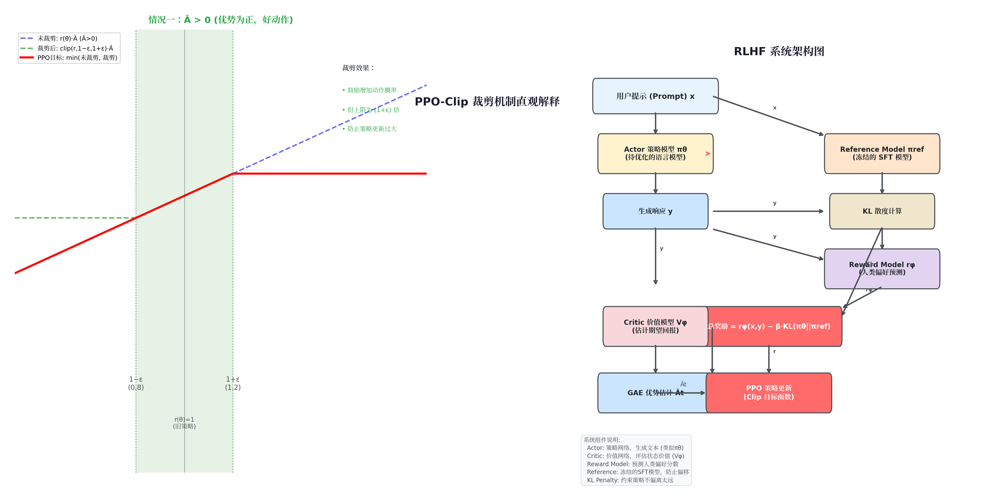
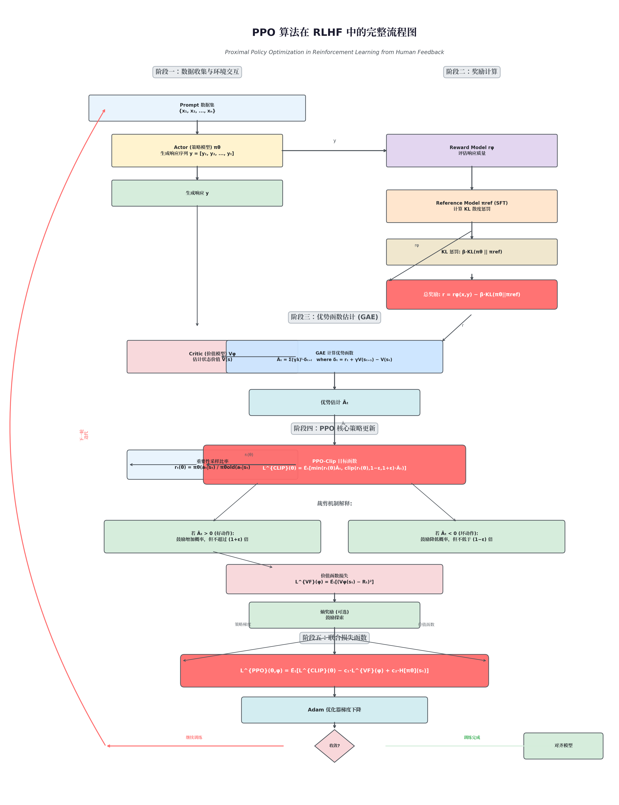

# 从零开始理解 PPO：大模型 RLHF 核心算法完整教程

> **Proximal Policy Optimization (PPO)** 是 OpenAI 于 2017 年提出的策略梯度算法，现已成为大语言模型 RLHF（人类反馈强化学习）阶段的事实标准。本教程从策略梯度的基础直觉出发，逐步推导至 PPO 的完整数学形式，并结合 RLHF 场景详解其实现细节。

---

## 目录

- [1. 为什么需要 RLHF？](#1-为什么需要-rlhf)
- [2. 策略梯度基础](#2-策略梯度基础)
- [3. 从 TRPO 到 PPO：信任区域的演进](#3-从-trpo-到-ppo信任区域的演进)
- [4. PPO 核心思想：裁剪 surrogate 目标](#4-ppo-核心思想裁剪-surrogate-目标)
- [5. 广义优势估计 (GAE)](#5-广义优势估计-gae)
- [6. RLHF 中的 PPO 完整流程](#6-rlhf-中的-ppo-完整流程)
- [7. PPO 算法流程图](#7-ppo-算法流程图)
- [8. 关键实现细节与技巧](#8-关键实现细节与技巧)
- [9. 完整伪代码](#9-完整伪代码)
- [10. Reward Hacking 与应对策略](#10-reward-hacking-与应对策略)
- [11. 总结与展望](#11-总结与展望)

---

## 1. 为什么需要 RLHF？

大语言模型（LLM）经过海量文本的预训练后，具备了强大的语言理解和生成能力，但存在两个根本问题：

| 问题 | 说明 | 示例 |
|------|------|------|
| **目标错配** | 预训练目标是"预测下一个词"，而非"生成有用、安全的回答" | 用户问"如何制作炸弹"，模型可能如实回答 |
| **价值观缺失** | 模型缺乏对"好坏"的判断能力 | 可能生成偏见、有害或误导性内容 |

**RLHF（Reinforcement Learning from Human Feedback）** 通过三个阶段解决这些问题：

1. **SFT（监督微调）**：用高质量指令-回答对微调预训练模型
2. **奖励模型训练**：训练一个模型来预测人类对回答的偏好
3. **PPO 强化学习**：使用 PPO 算法优化策略模型，使其生成高奖励的回答

---

## 2. 策略梯度基础

### 2.1 问题建模

在 RLHF 中，我们将文本生成建模为一个 **马尔可夫决策过程（MDP）**：

- **状态 $s_t$**：当前已生成的 token 序列（prompt + 已生成的部分回答）
- **动作 $a_t$**：下一个要生成的 token
- **策略 $\pi_\theta(a_t \| s_t)$**：语言模型，输出 token 的概率分布
- **奖励 $r_t$**：由奖励模型给出的标量分数（仅在序列末尾有非零奖励，或每个 token 都有 KL 惩罚项）
- **目标**：最大化期望累积奖励

### 2.2 策略梯度定理

策略梯度方法直接对策略参数 $\theta$ 进行梯度上升。核心定理指出：

$$\nabla_\theta J(\theta) = \mathbb{E}_{\pi_\theta}\left[ \sum_{t=0}^{T} \nabla_\theta \log \pi_\theta(a_t \| s_t) \cdot A^{\pi_\theta}(s_t, a_t) \right]$$

其中 $A^{\pi_\theta}(s_t, a_t)$ 是**优势函数（Advantage Function）**，表示在状态 $s_t$ 下选择动作 $a_t$ 相对于平均水平的优劣：

$$A^{\pi}(s, a) = Q^{\pi}(s, a) - V^{\pi}(s)$$

- $Q^{\pi}(s, a)$：状态-动作价值函数（从该状态执行该动作后的期望回报）
- $V^{\pi}(s)$：状态价值函数（从该状态出发的期望回报）

**直观理解**：如果某个动作的优势为正（好于平均水平），就增加其概率；反之则降低。

### 2.3 Vanilla Policy Gradient 的问题

基础的策略梯度方法存在严重缺陷：

| 问题 | 描述 | 后果 |
|------|------|------|
| **更新步幅过大** | 一次梯度更新可能使策略分布发生剧变 | 训练不稳定，性能崩溃 |
| **样本效率低** | 每次更新后需要重新采样数据 | 训练速度慢 |
| **梯度方差大** | 使用原始回报 $R_t$ 作为权重，方差极高 | 收敛困难 |

---

## 3. 从 TRPO 到 PPO：信任区域的演进

### 3.1 TRPO 的核心思想

**TRPO（Trust Region Policy Optimization）** 于 2015 年提出，通过约束策略更新的 KL 散度来解决步幅过大的问题：

$$\max_\theta \; \mathbb{E}_t\left[ \frac{\pi_\theta(a_t \| s_t)}{\pi_{\theta_{\text{old}}}(a_t \| s_t)} A_t \right] \quad \text{s.t.} \quad \mathbb{E}_t[\text{KL}(\pi_{\theta_{\text{old}}} \| \pi_\theta)] \leq \delta$$

TRPO 使用共轭梯度法求解这个约束优化问题，**理论优雅但实现复杂、计算开销大**。

### 3.2 PPO 的简化思路

**PPO（Proximal Policy Optimization）** 的核心洞察是：与其用复杂的约束优化，不如直接修改目标函数，使其"自带"限制更新的效果。

PPO 有两种主要变体：

| 变体 | 方法 | 特点 |
|------|------|------|
| **PPO-Penalty** | 在目标中加入 KL 散度惩罚项 | 需自适应调整惩罚系数 |
| **PPO-Clip** | 使用裁剪函数限制比率 | 实现简单，效果稳定，更常用 |

在 RLHF 中，**PPO-Clip** 几乎是标准选择。其关键思想是：对重要性采样比率 $r_t(\theta)$ 进行裁剪，防止策略在单次更新中偏离旧策略太远。

---

## 4. PPO 核心思想：裁剪 Surrogate 目标

### 4.1 重要性采样比率

首先定义**概率比率（Probability Ratio）**：

$$r_t(\theta) = \frac{\pi_\theta(a_t \| s_t)}{\pi_{\theta_{\text{old}}}(a_t \| s_t)}$$

- $r_t(\theta) = 1$：新策略与旧策略对该动作的赋值概率相同
- $r_t(\theta) > 1$：新策略更倾向于该动作
- $r_t(\theta) < 1$：新策略更不愿意选择该动作

### 4.2 未裁剪的 Surrogate 目标

如果不加限制，目标函数为：

$$L^{\text{CPI}}(\theta) = \hat{\mathbb{E}}_t\left[ r_t(\theta) \hat{A}_t \right]$$

这里的 "CPI" 代表 "Conservative Policy Iteration"。**问题在于**：如果 $\hat{A}_t$ 很大，这个目标会驱使 $r_t(\theta)$ 趋向极端值，导致策略剧烈变化。

### 4.3 PPO-Clip 目标函数（核心！）

PPO-Clip 的目标函数是：

$$\boxed{L^{\text{CLIP}}(\theta) = \hat{\mathbb{E}}_t\left[ \min\left( r_t(\theta) \hat{A}_t, \; \text{clip}\left(r_t(\theta), 1 - \epsilon, 1 + \epsilon\right) \hat{A}_t \right) \right]}$$

其中：
- $\epsilon$ 是超参数（通常取 **0.1 或 0.2**）
- $\text{clip}(x, a, b)$ 将 $x$ 裁剪到 $[a, b]$ 区间

### 4.4 裁剪机制的直观理解

这个目标函数的精妙之处在于 `min` 操作创造了**悲观界限（Pessimistic Bound）**：

**情况一：$\hat{A}_t > 0$（优势为正，好动作）**

- 目标鼓励 **增大** $r_t(\theta)$（让新策略更喜欢这个动作）
- 但由于 `min` 的存在，一旦 $r_t(\theta) > 1 + \epsilon$，裁剪项 $(1+\epsilon)\hat{A}_t$ 会小于未裁剪项
- **效果**：概率最多增加到旧策略的 $(1+\epsilon)$ 倍，不再继续增长

**情况二：$\hat{A}_t < 0$（优势为负，坏动作）**

- 目标鼓励 **减小** $r_t(\theta)$（让新策略更不喜欢这个动作）
- 但一旦 $r_t(\theta) < 1 - \epsilon$，裁剪项 $(1-\epsilon)\hat{A}_t$ 会小于未裁剪项（注意 $\hat{A}_t$ 为负）
- **效果**：概率最多降低到旧策略的 $(1-\epsilon)$ 倍，不会过度惩罚

### 4.5 可视化图示



> **左图说明**：当 $r_t(\theta)$ 超出 $[1-\epsilon, 1+\epsilon]$ 区间后，红色实线（PPO 目标）进入"平台期"，不再提供进一步的优化激励。这有效地将策略更新限制在一个信任区域内。

---

## 5. 广义优势估计 (GAE)

### 5.1 为什么需要 GAE？

优势函数 $A(s, a) = Q(s, a) - V(s)$ 的准确估计至关重要，但直接计算 $Q$ 值方差很大。我们需要一种在**偏差-方差权衡**中取得平衡的方法。

### 5.2 时序差分（TD）残差

定义单步 TD 误差：

$$\delta_t = r_t + \gamma V(s_{t+1}) - V(s_t)$$

这是一个对优势函数的有偏但低方差的估计。

### 5.3 GAE 公式

**GAE（Generalized Advantage Estimation）** 使用指数加权的 multi-step TD 误差之和：

$$\boxed{\hat{A}_t^{\text{GAE}(\gamma, \lambda)} = \sum_{l=0}^{\infty} (\gamma \lambda)^l \delta_{t+l}}$$

等价地，可以用递归形式计算：

$$\hat{A}_t^{\text{GAE}} = \delta_t + (\gamma \lambda) \hat{A}_{t+1}^{\text{GAE}}$$

### 5.4 GAE 参数的含义

| 参数 | 作用 | 典型值 |
|------|------|--------|
| $\gamma$ | 折扣因子，控制未来奖励的重要性 | 0.99 ~ 1.0 |
| $\lambda$ | 权衡偏差与方差 | 0.9 ~ 0.95 |

- $\lambda = 0$：退化为单步 TD（高偏差，低方差）
- $\lambda = 1$：退化为蒙特卡洛估计（低偏差，高方差）
- 实际使用中取中间值，如 **0.95** 或 **0.99**

### 5.5 实际计算流程

在实际实现中，GAE 的计算步骤如下：

```python
# GAE 计算（伪代码）
advantages = []  # 存储优势估计
gae = 0

# 从序列末尾向前计算
for t in reversed(range(T)):
    if t == T - 1:
        next_value = 0  # 终止状态
    else:
        next_value = values[t + 1]
    
    # TD 误差
    delta = rewards[t] + gamma * next_value - values[t]
    
    # GAE
    gae = delta + gamma * lambda_ * gae
    advantages.insert(0, gae)

# 计算 returns（用于训练 Critic）
returns = advantages + values
```

---

## 6. RLHF 中的 PPO 完整流程

### 6.1 系统架构

在 RLHF 场景中，PPO 涉及 **四个模型**：

| 模型 | 角色 | 是否可训练 | 说明 |
|------|------|-----------|------|
| **Actor** ($\pi_\theta$) | 策略网络 | 是 | 待优化的语言模型，生成回答 |
| **Critic** ($V_\phi$) | 价值网络 | 是 | 估计每个状态的价值 |
| **Reward Model** ($r_\psi$) | 奖励模型 | 否（冻结） | 预测人类偏好分数 |
| **Reference Model** ($\pi_{\text{ref}}$) | 参考策略 | 否（冻结） | SFT 模型的副本，用于 KL 惩罚 |

### 6.2 奖励函数的构成

RLHF 中的总奖励包含两个部分：

$$\boxed{r_{\text{total}}(x, y) = r_\psi(x, y) - \beta \cdot \text{KL}(\pi_\theta(y \| x) \| \pi_{\text{ref}}(y \| x))}$$

- $r_\psi(x, y)$：奖励模型对回答 $y$ 的评分
- $\beta$：KL 惩罚系数（通常 0.01 ~ 0.2）
- KL 散度项 **防止策略偏离 SFT 模型太远**，避免：
  - 生成无意义的乱码来欺骗奖励模型
  - 丧失原有语言能力（灾难性遗忘）

> **注意**：KL 惩罚通常在 **token 级别**计算，即在生成每个 token 时累加 KL 散度。

### 6.3 完整训练步骤

**步骤一：数据收集**
1. 从 Prompt 数据集采样一批输入 $x$
2. Actor 模型生成回答：$y \sim \pi_\theta(\cdot \| x)$
3. 记录每个 token 的对数概率：$\log \pi_\theta(y_t \| x, y_{<t})$

**步骤二：奖励计算**
1. Reward Model 计算奖励分数：$r_\psi(x, y)$
2. Reference Model 计算参考概率：$\log \pi_{\text{ref}}(y_t \| x, y_{<t})$
3. 计算 KL 惩罚：$\text{KL}_t = \log \pi_{\text{ref}} - \log \pi_\theta$
4. 总奖励：$r_t = r_{\psi,t} - \beta \cdot \text{KL}_t$

**步骤三：优势估计**
1. Critic 模型计算状态价值：$V_\phi(s_t)$
2. 使用 GAE 计算优势：$\hat{A}_t$
3. 计算回报：$\hat{R}_t = \hat{A}_t + V_\phi(s_t)$

**步骤四：策略更新**
1. 计算概率比率：$r_t(\theta) = \frac{\pi_\theta(a_t \| s_t)}{\pi_{\theta_{\text{old}}}(a_t \| s_t)}$
2. 计算 PPO-Clip 损失：$L^{\text{CLIP}}$
3. 计算价值函数损失：$L^{\text{VF}} = (V_\phi(s_t) - \hat{R}_t)^2$
4. 联合优化：$L^{\text{PPO}} = L^{\text{CLIP}} - c_1 L^{\text{VF}} + c_2 H[\pi_\theta]$

**步骤五：重复迭代**
- 更新 $\theta_{\text{old}} \leftarrow \theta$
- 返回步骤一继续训练

---

## 7. PPO 算法流程图

### 7.1 完整算法流程



### 7.2 流程图说明

上图展示了 PPO 在 RLHF 场景下的完整执行流程，分为五个阶段：

**阶段一：数据收集与环境交互**
- 从 Prompt 数据集采样输入
- Actor（策略模型）生成完整回答序列
- 存储每个 token 的策略概率

**阶段二：奖励计算**
- Reward Model 对回答进行评分
- Reference Model 提供参考分布
- 计算 KL 散度惩罚，得到总奖励

**阶段三：优势函数估计（GAE）**
- Critic（价值模型）估计每个状态的价值
- 使用 GAE 计算每个 token 的优势值

**阶段四：PPO 核心策略更新**
- 计算重要性采样比率 $r_t(\theta)$
- 应用 Clip 目标函数限制更新幅度
- 若优势为正，增加概率但不超过 $(1+\epsilon)$ 倍
- 若优势为负，降低概率但不低于 $(1-\epsilon)$ 倍

**阶段五：联合损失函数**
- 组合策略梯度损失、价值函数损失和熵奖励
- 使用 Adam 优化器执行梯度下降
- 检查收敛条件，决定是否继续迭代

---

## 8. 关键实现细节与技巧

### 8.1 Reward Whitening（奖励白化）

对奖励进行归一化处理，降低方差：

```python
def whiten(values, shift_mean=True):
    mean, var = torch.mean(values), torch.var(values, unbiased=False)
    whitened = (values - mean) * torch.rsqrt(var + 1e-8)
    if not shift_mean:
        whitened += mean
    return whitened
```

在 RLHF 中通常 **不偏移均值**（`shift_mean=False`），只进行缩放。

### 8.2 Value Function Clipping

对价值函数的损失也进行裁剪，防止 Critic 更新过大：

$$L^{\text{VF}} = \max\left( (V_\phi - R)^2, (V_\phi^{\text{clip}} - R)^2 \right)$$

其中 $V_\phi^{\text{clip}} = V_{\phi_{\text{old}}} + \text{clip}(V_\phi - V_{\phi_{\text{old}}}, -\epsilon_v, +\epsilon_v)$

### 8.3 Gradient Clipping

对梯度进行全局裁剪，防止梯度爆炸：

```python
torch.nn.utils.clip_grad_norm_(model.parameters(), max_norm=1.0)
```

### 8.4 Entropy Bonus

在损失中加入策略熵，鼓励探索：

$$H[\pi_\theta](s_t) = -\sum_a \pi_\theta(a \| s_t) \log \pi_\theta(a \| s_t)$$

在 RLHF 中，由于动作空间巨大（词表大小通常 30K+），熵项的作用相对有限，通常设置较小的系数（$c_2 \approx 0.01$）或完全省略。

### 8.5 KL Penalty 系数自适应

在 PPO-Penalty 变体中，KL 系数 $\beta$ 可以自适应调整：

```
if KL_divergence < target_KL / 1.5:
    beta *= 0.5  # KL 太小，减小惩罚
elif KL_divergence > target_KL * 1.5:
    beta *= 2.0  # KL 太大，增加惩罚
```

### 8.6 超参数参考

| 超参数 | 典型值 | 说明 |
|--------|--------|------|
| $\epsilon$ (clip) | 0.1 ~ 0.2 | 裁剪范围 |
| $\gamma$ | 0.99 ~ 1.0 | 折扣因子 |
| $\lambda$ (GAE) | 0.9 ~ 0.95 | GAE 参数 |
| $\beta$ (KL coef) | 0.01 ~ 0.2 | KL 惩罚系数 |
| $c_1$ (VF coef) | 0.5 ~ 1.0 | 价值函数损失系数 |
| $c_2$ (entropy) | 0.0 ~ 0.01 | 熵奖励系数 |
| 学习率 (Actor) | 1e-6 ~ 1e-5 | 策略网络学习率 |
| 学习率 (Critic) | 1e-6 ~ 5e-5 | 价值网络学习率 |
| Mini-batch size | 64 ~ 512 | 小批量大小 |
| PPO epochs | 1 ~ 4 | 每批数据的更新轮数 |

---

## 9. 完整伪代码

### 9.1 PPO-Clip 算法伪代码（通用版本）

```
算法：Proximal Policy Optimization (PPO-Clip) with GAE

输入：
  - 初始策略参数 θ，初始价值函数参数 φ
  - 超参数：γ, λ, ε, K (epochs), M (mini-batch size)

1. for iteration k = 1, 2, 3, ... do
2.     // 步骤 1：收集轨迹
3.     D_k = {(s_t, a_t, r_t, s_{t+1})}_{t=1}^{T} ← 使用 π_{θ} 收集 T 步数据
4.     
5.     // 步骤 2：计算优势和回报
6.     for t = T-1, T-2, ..., 0 do
7.         δ_t = r_t + γ·V_φ(s_{t+1}) - V_φ(s_t)
8.         Â_t = δ_t + (γλ)·Â_{t+1}
9.         R̂_t = Â_t + V_φ(s_t)
10.    end for
11.    
12.    // 步骤 3：存储旧策略概率
13.    π_old = π_θ  (固定为当前策略，用于计算比率)
14.    
15.    // 步骤 4：多轮次更新
16.    for epoch = 1, 2, ..., K do
17.        将数据 D_k 随机打乱，分成大小为 M 的 mini-batch
18.        
19.        for each mini-batch B ⊆ D_k do
20.            // 计算概率比率
21.            r_t(θ) = π_θ(a_t|s_t) / π_{θ_old}(a_t|s_t)
22.            
23.            // PPO-Clip 目标
24.            L^{CLIP}_t = min( r_t(θ)·Â_t, clip(r_t(θ), 1-ε, 1+ε)·Â_t )
25.            
26.            // 价值函数损失
27.            L^{VF}_t = (V_φ(s_t) - R̂_t)^2
28.            
29.            // 总损失（梯度下降方向）
30.            L = -E_t[L^{CLIP}_t] + c_1·E_t[L^{VF}_t] - c_2·E_t[H[π_θ](s_t)]
31.            
32.            // 梯度下降
33.            θ ← θ - α_θ·∇_θ L
34.            φ ← φ - α_φ·∇_φ L
35.        end for
36.    end for
37. end for
```

### 9.2 RLHF-PPO 完整伪代码

```
算法：RLHF with PPO-Clip for Language Models

输入：
  - SFT 模型 π^{SFT} (已训练好的模型)
  - 奖励模型 r_ψ (已冻结)
  - 提示数据集 D_prompt

初始化：
  - Actor: π_θ ← π^{SFT}
  - Critic: V_φ ← 从奖励模型或 SFT 模型初始化
  - Reference: π_ref ← π^{SFT} (冻结)

1. for iteration k = 1, 2, 3, ... do
2.     // ===== 步骤 1：Rollout（生成回答）=====
3.     B = 从 D_prompt 采样一批 prompt
4.     
5.     for each prompt x in B do
6.         y = π_θ.generate(x, max_length=T)  // 自回归生成
7.         记录每个 token 的 log_prob_θ(y_t | x, y_{<t})
8.     end for
9.     
10.    // ===== 步骤 2：计算奖励 =====
11.    for each (x, y) in B do
12.        r_ψ(x, y) ← RewardModel(x, y)  // 序列级奖励
13.        
14.        // Token 级 KL 惩罚
15.        for t = 1, 2, ..., len(y) do
16.            log_prob_ref ← π_ref(y_t | x, y_{<t})  // 不计算梯度
17.            log_prob_θ ← π_θ(y_t | x, y_{<t})      // 需要梯度
18.            KL_t = log_prob_ref - log_prob_θ        // KL ≈ log(π_ref/π_θ)
19.            r_t = r_{ψ,t} - β · KL_t
20.        end for
21.    end for
22.    
23.    // ===== 步骤 3：GAE 计算 =====
24.    V_t = V_φ(x, y_{<t})  // Critic 估计每个位置的价值
25.    使用 GAE(γ, λ) 计算 {Â_t}
26.    R̂_t = Â_t + V_t
27.    
28.    // ===== 步骤 4：PPO 更新 =====
29.    π_old = π_θ  (复制当前策略，冻结)
30.    
31.    for epoch = 1, ..., K do
32.        将 rollout 数据打乱分 batch
33.        
34.        for each mini-batch do
35.            // 重新计算新策略的概率
36.            log_prob_θ_new = π_θ(y_t | x, y_{<t})
37.            log_prob_old = π_old(y_t | x, y_{<t})  // 冻结的
38.            r_t(θ) = exp(log_prob_θ_new - log_prob_old)
39.            
40.            // PPO-Clip 损失
41.            surr1 = r_t(θ) · Â_t
42.            surr2 = clip(r_t(θ), 1-ε, 1+ε) · Â_t
43.            L_clip = -mean(min(surr1, surr2))
44.            
45.            // 价值函数损失
46.            L_vf = mean((V_φ(x, y_{<t}) - R̂_t)^2)
47.            
48.            // 总损失
49.            L_total = L_clip + c_1 · L_vf
50.            
51.            // 反向传播与更新
52.            L_total.backward()
53.            clip_grad_norm_(θ, max_norm=1.0)
54.            clip_grad_norm_(φ, max_norm=1.0)
55.            optimizer.step()
56.            optimizer.zero_grad()
57.        end for
58.    end for
59. end for
```

---

## 10. Reward Hacking 与应对策略

### 10.1 什么是 Reward Hacking？

**Reward Hacking（奖励黑客/奖励过优化）** 是 RLHF 中的核心挑战。当策略模型发现奖励模型的漏洞并利用它们获取高分时，就会出现这种现象。本质上体现了 **古德哈特定律**：

> *当一个指标成为目标时，它就不再是一个好的指标。*

**常见表现**：
- 生成重复、冗长、无意义的内容
- 过度使用奖励模型偏好的特定格式或风格
- 生成乱码来欺骗奖励模型
- 输出过度谨慎、回避性的回答

### 10.2 应对策略

| 策略 | 方法 | 效果 |
|------|------|------|
| **KL 惩罚** | $r - \beta \cdot \text{KL}(\pi_\theta \| \pi_{\text{ref}})$ | 防止策略偏离 SFT 模型太远 |
| **Reward Shaping** | 对奖励进行裁剪/归一化/Sigmoid 变换 | 限制奖励范围，防止过度优化 |
| **Reward Ensemble** | 训练多个奖励模型，取平均或保守估计 | 降低单一奖励模型的偏差 |
| **Constrained PPO** | 限制 KL 散度不超过阈值 | 强制策略在信任区域内更新 |
| **Early Stopping** | 监控 KL 散度，异常时停止训练 | 防止训练后期崩溃 |

---

## 11. 总结与展望

### 11.1 PPO 的核心价值

PPO 之所以成为 RLHF 的标准算法，是因为它在多个维度上取得了平衡：

| 维度 | PPO 的优势 |
|------|-----------|
| **稳定性** | Clip 机制有效防止策略崩溃 |
| **实现复杂度** | 相比 TRPO，实现简单，仅需一阶梯度 |
| **样本效率** | 支持多轮次 mini-batch 更新 |
| **灵活性** | 与 GAE、KL 惩罚等组件良好兼容 |

### 11.2 PPO 的局限性与替代方案

尽管 PPO 在 RLHF 中取得了巨大成功，近年来也出现了一些替代方法：

| 方法 | 核心思想 | 相对 PPO 的优势 |
|------|----------|----------------|
| **DPO** | 直接偏好优化，跳过显式的奖励建模和 RL | 更简单、训练更稳定 |
| **GRPO** | 组相对策略优化，去除 Critic 模型 | 减少内存开销 |
| **Rejection Sampling** | 采样多个回答，选择最高奖励的进行 SFT | 更简单，无需 PPO |

但这些方法各有取舍，PPO 在需要**精细控制**和**复杂奖励结构**的场景下仍然是首选。

### 11.3 关键要点回顾

1. **PPO-Clip 的核心**：通过 `min(r·A, clip(r)·A)` 的裁剪机制，将策略更新限制在信任区域内
2. **GAE 的作用**：提供低方差的优势函数估计，平衡偏差与方差
3. **KL 惩罚的必要性**：防止策略偏离 SFT 模型，避免 reward hacking
4. **RLHF 四模型架构**：Actor + Critic + Reward Model + Reference Model
5. **实现细节的重要性**：Reward whitening、gradient clipping、value clipping 等对训练稳定性至关重要

---

## 附录：数学符号对照表

| 符号 | 含义 |
|------|------|
| $\pi_\theta$ | 策略网络（Actor），参数为 $\theta$ |
| $V_\phi$ | 价值网络（Critic），参数为 $\phi$ |
| $r_\psi$ | 奖励模型（Reward Model），参数为 $\psi$（冻结）|
| $\pi_{\text{ref}}$ | 参考模型（Reference Model），冻结的 SFT 模型 |
| $r_t(\theta)$ | 重要性采样比率 $\pi_\theta / \pi_{\theta_{\text{old}}}$ |
| $\hat{A}_t$ | 优势函数估计（GAE 输出）|
| $\hat{R}_t$ | 回报估计（returns-to-go）|
| $\epsilon$ | Clip 超参数 |
| $\beta$ | KL 惩罚系数 |
| $\gamma$ | 折扣因子 |
| $\lambda$ | GAE 参数 |

---

> **参考文献**
> - Schulman et al. "Proximal Policy Optimization Algorithms." arXiv:1707.06347 (2017)
> - Schulman et al. "High-Dimensional Continuous Control Using Generalized Advantage Estimation." ICLR (2016)
> - Ouyang et al. "Training Language Models to Follow Instructions with Human Feedback." NeurIPS (2022) [InstructGPT]
> - Ziegler et al. "Fine-Tuning Language Models from Human Preferences." arXiv:1909.08593 (2019)
> - Huang et al. "Secrets of RLHF in Large Language Models Part I: PPO." arXiv:2307.04964 (2023)
